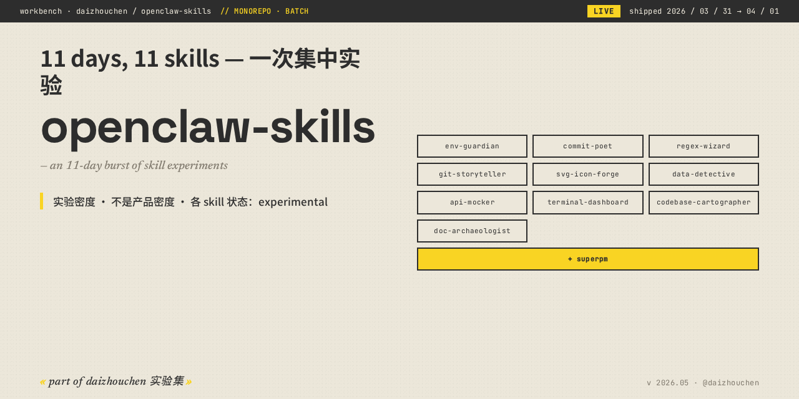

<!-- daizhouchen-banner-begin -->

  

> **11 days, 11 skills — 一次集中实验。10 个 Claude Code Skill 合集。**
>
> *an 11-day burst of skill experiments — 10 archived in this monorepo.*
<!-- daizhouchen-banner-end -->

# openclaw-skills

> 11 days, 11 skills — 2026 年 3 月 31 日开始的一次集中实验。

我用十一天的时间从 0 到 1 集中产出了一批 Claude Code Skill，
然后回头看哪些值得继续做、哪些只是概念验证。
**这个仓收纳其中 10 个**；剩下一个 [superpm](https://github.com/daizhouchen/superpm) 独立保留。

## 收录

| 子目录 | 一句话 |
|--------|--------|
| [env-guardian](skills/env-guardian) | 环境变量审计 + .env.example 生成 |
| [commit-poet](skills/commit-poet) | 6 风格 commit message（含鲁迅风、俳句风） |
| [regex-wizard](skills/regex-wizard) | 自然语言→正则 + railroad diagram |
| [git-storyteller](skills/git-storyteller) | Git 历史→电影感 HTML 叙事 |
| [svg-icon-forge](skills/svg-icon-forge) | 自然语言→5 风格 SVG 图标 |
| [data-detective](skills/data-detective) | CSV/JSON 异常侦探报告 |
| [api-mocker](skills/api-mocker) | OpenAPI→可跑的 Express mock 服务 |
| [terminal-dashboard](skills/terminal-dashboard) | Rich 终端 dashboard 生成 |
| [codebase-cartographer](skills/codebase-cartographer) | D3.js 架构图扫描 |
| [doc-archaeologist](skills/doc-archaeologist) | 文档过期/失效扫描 + A-F 健康分 |

## 立场

不是每个都要做成产品。这是**实验密度**，不是产品密度。
当时一天产一个，是为了把 idea throughput 拉满。
现在回看，几个有继续做的潜力（commit-poet / git-storyteller / svg-icon-forge），
其余作为参考留档。

## 原因

每个子目录在原 README 顶部带 banner 标注其状态。所有子目录共享本仓 MIT License。
原始 10 个独立仓在 monorepo 验证完整后，已 archive 不再独立维护——历史保留可追溯。

## License

MIT

---
<!-- daizhouchen-footer-begin -->

Part of [**daizhouchen 实验集**](https://github.com/daizhouchen) → 一个 AI 应用创造者的实验现场。
<!-- daizhouchen-footer-end -->
