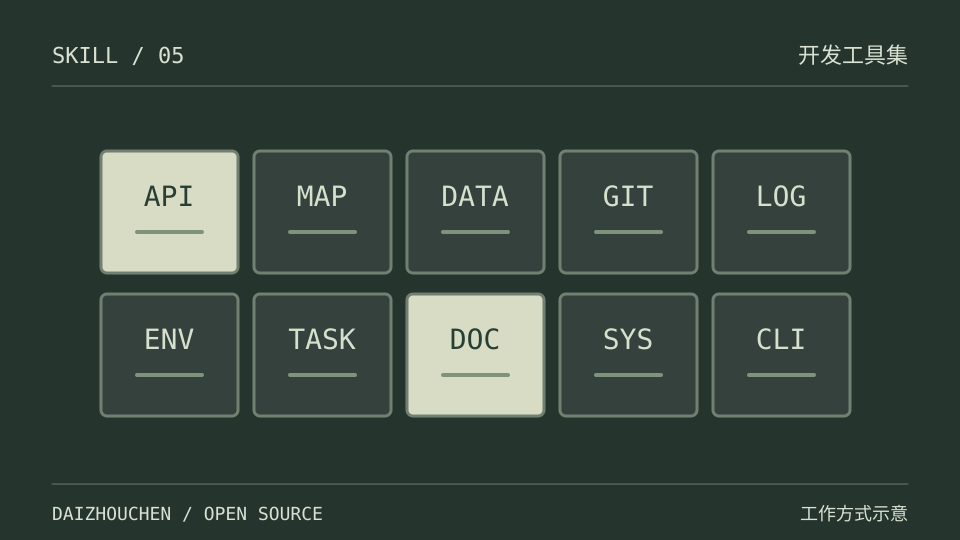

# OpenClaw Skills



10 个面向开发任务的 `SKILL.md` 技能实验：用指令、脚本与模板处理常见工作。独立的项目管理技能见 [SuperPM](https://github.com/daizhouchen/superpm)。

## 技能索引

| 技能 | 实际用途 |
|---|---|
| [env-guardian](skills/env-guardian) | 环境变量引用与配置风险检查，生成示例配置 |
| [commit-poet](skills/commit-poet) | 根据 Git diff 起草 6 种风格的提交说明 |
| [regex-wizard](skills/regex-wizard) | 正则表达式、SVG 铁路图与测试页面 |
| [git-storyteller](skills/git-storyteller) | Git 历史分析与 HTML 时间线报告 |
| [svg-icon-forge](skills/svg-icon-forge) | 生成、优化和校验 5 种风格的 SVG 图标 |
| [data-detective](skills/data-detective) | CSV、JSON、Excel 缺失、重复与统计异常分析 |
| [api-mocker](skills/api-mocker) | 从 OpenAPI 生成简单资源的 Express mock 服务 |
| [terminal-dashboard](skills/terminal-dashboard) | 从 YAML 配置生成 Rich 终端仪表盘 |
| [codebase-cartographer](skills/codebase-cartographer) | 静态 import 依赖扫描与 D3.js 代码地图 |
| [doc-archaeologist](skills/doc-archaeologist) | 文档时效、引用一致性检查与修复建议 |

## 安装一个技能

仓库根目录不是技能入口；安装所需的 `skills/<name>` 目录。以 Claude Code 为例（Bash / Git Bash）：

```bash
git clone https://github.com/daizhouchen/openclaw-skills.git
mkdir -p "$HOME/.claude/skills"
cp -R openclaw-skills/skills/commit-poet "$HOME/.claude/skills/"
```

Codex 用户可将目标目录改为 `${CODEX_HOME:-$HOME/.codex}/skills`。 OpenClaw 用户可使用共享技能目录 `~/.openclaw/skills`（[官方说明](https://docs.openclaw.ai/tools/skills)）。安装前检查同名目录，保留已有自定义内容。其他支持 `SKILL.md` 的工具请使用其技能目录。

在目标项目中提出对应任务，例如“根据暂存区 diff 写一条 Conventional Commit 提交说明”。脚本和资产路径以安装后的技能目录为准，工作目录与输出位置由任务决定。

## 运行要求与边界

- Python 脚本建议使用 Python 3.10+。数据分析需要 `pandas numpy`（Excel 另需 `openpyxl` / `xlrd`），仪表盘需要 `rich psutil pyyaml`，YAML API 规范需要 `pyyaml`。
- Git 分析需要 Git；提交说明助手使用 Bash；API mock 生成器需要 Node.js，生成的服务依赖 Express。
- 这些是实验性工具，详细参数见各技能目录。静态扫描和统计报告提供线索，结果需结合项目上下文判断。
- Mock 服务用于本地联调，不提供生产鉴权；部分 HTML 图表依赖 CDN。生成文件、运行服务和修改项目应遵循当前请求范围。

原始独立仓库与子目录内的来源、状态说明保留，后续整理在本 monorepo 进行。

## License

[MIT](LICENSE)
